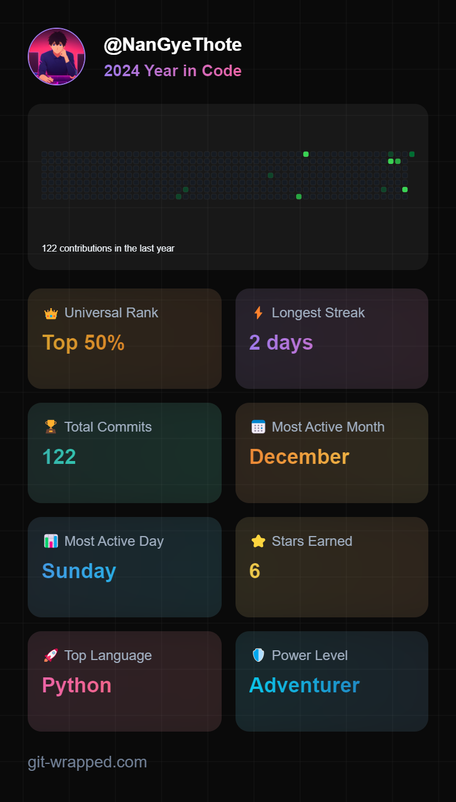

# Hi there, I'm Shin Thant Phyo 👋

Welcome to my GitHub profile! Here's a little about me:

## 🚀 About Me
- 🌱 I’m currently learning **Artificial Intelligence and Software Engineering**
- 👯 I’m looking to collaborate on **Machine Learning**
- 💬 Ask me about **AI and Myanmar**
- 📫 How to reach me: **thant.ict.phyomg0107@gmail.com**
- 😄 Pronouns: He/Him
- ⚡ Fun fact: **I love to read manga, watch anime and support Manchester United!**

## 🛠️ Technologies & Tools
- Programming Languages: **JavaEE, Python, MySQL, PHP**
- Frameworks & Libraries: **Spring, NgularJS, React, Laravel**
- Tools & Platforms: **Eclipse, VSCode, Colab, Streamlit, GitHub, Anaconda, PyCharm, Itelli-J, Beans**

## 📈 GitHub Stats

## 📊 Git-Wrapped Status

## 📫 Connect with me
- [Email](mailto:[thant.ict.phyomg0107@gmail.com])

## 📝 Latest Blog Posts
<!-- BLOG-POST-LIST:START -->
<!-- - [Insert your latest blog post title](insert your blog post link) -->
- None
<!-- BLOG-POST-LIST:END -->

## 🔧 Projects

| Project       | Description                                                                                  | Technologies                |
|---------------|----------------------------------------------------------------------------------------------|-----------------------------|
| [SkyPals](https://github.com/NanGyeThote/portfolio.git) | Airplane ticket reservation system.                                           | Java, Spring               |
| [Space-Fighter](https://github.com/NanGyeThote/Space-Fighter.git) | Python 2D game using pure Python and built-in GUI.                           | Python                     |
| [Snake-Game](https://github.com/NanGyeThote/SnakeGame.git) | Python 2D game using pure Python and built-in GUI.                           | Python                     |
| [Vote-Mal](https://github.com/NanGyeThote/Vote-Mal.git) | Voting management system for all.                                            | PHP, HTML, CSS, JS, DB     |

## ⭐️ Starred Repositories and AI Projects

| Project       | Description                                                                                  | Technologies                |
|---------------|----------------------------------------------------------------------------------------------|-----------------------------|
| [Classification With Chatbot](https://github.com/NanGyeThote/Classification-with-chatbot.git) | AI images classification with real-time chatbot using ResNet50 and groq API. | ResNet50, groq API, Streamlit |
| [PictoNet](https://github.com/NanGyeThote/PictoNet.git) | AI images classification project using ResNet50 and Streamlit.                | ResNet50, Streamlit        |
| [Object-Detection-YOLOv8](https://github.com/NanGyeThote/Object-Detection-Yolov8.git) | Real-time object detection project.                                           | YOLOv8                     |
| [Text-To-Image-Generation](https://github.com/NanGyeThote/Text-To-Image-Generation.git) | AI text-to-image generation project using Stable Diffusion.                   | Stable Diffusion           |
| [Tomato-Object-Detection](https://github.com/NanGyeThote/Tomato-Object-Detection.git) | AI-based tomato object detection using YOLOv8.                                | YOLOv8                     |

## 🎵 Entertainment & Funtivity 🎯

| Project       | Description                                                                                  | Technologies                |
|---------------|----------------------------------------------------------------------------------------------|-----------------------------|
| [Python-Lyrics](https://github.com/NanGyeThote/Python---Lyrics.git) | A Python script that displays the chorus of "Bad Girls Like U" with colored text and a typing effect. | Python                     |

Thanks for visiting my profile! 😊
